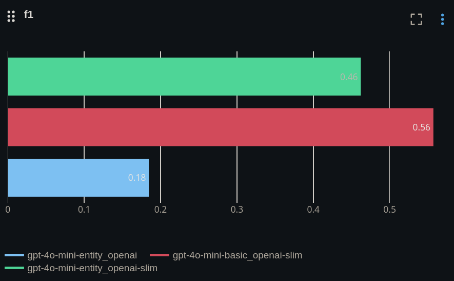
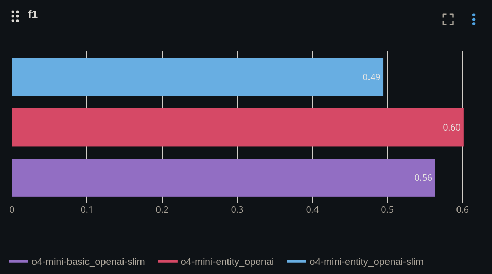
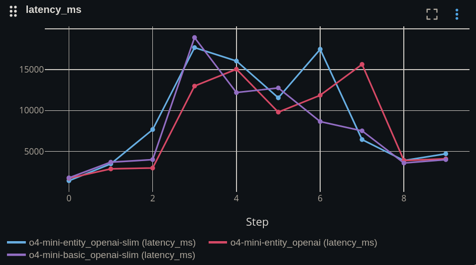
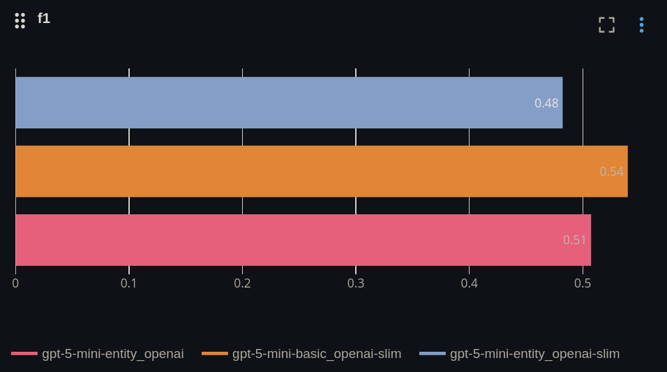
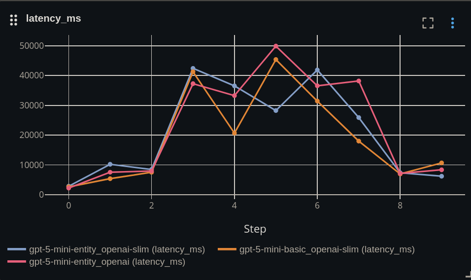
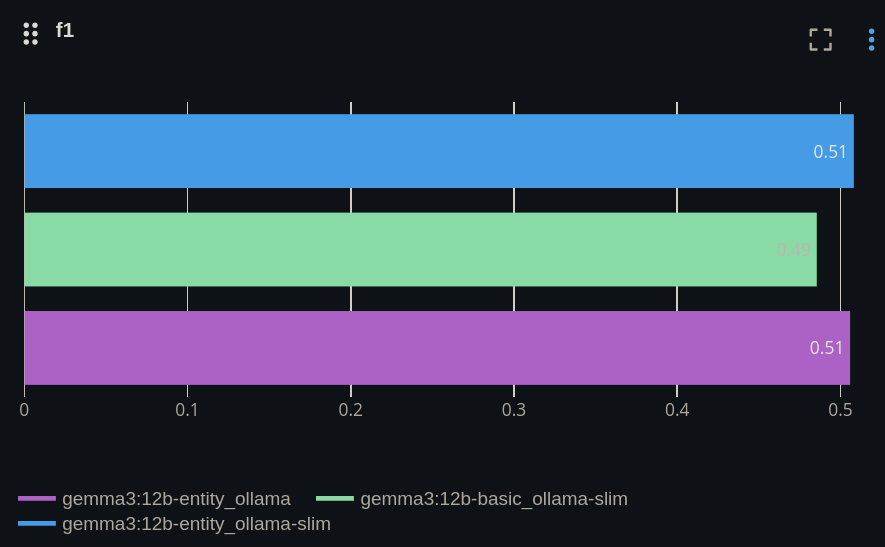
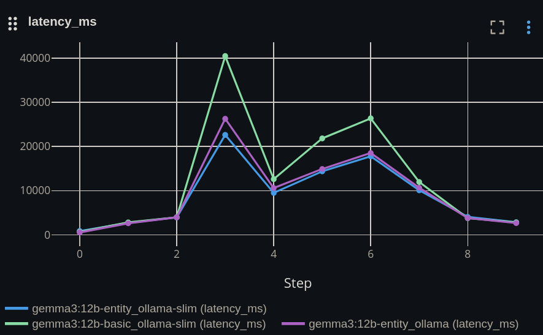

# Experiment "System prompt"
**Hypothesis:** using a system prompt does not yield any significant improvements.

- Strategy: openai-slim (the system prompt and user prompt is combined to one prompt)
- Strategy: openai (system prompt and user prompts are sent separately)

**Conclusion:**

The null hypothesis holds. Including the system prompt, within the user prompt with clear structure is better. However some latency improvements are expected but not significant.

**Note:** the system prompt is held in memory, and re-used, hence an expected latency improvement; but insignificant for this use-case.

**Note:** The server components are a black box on the cloud. The behaviour can change without notice. 

**Hint:** Evaluate with a small data set before deciding on a strategy. Evaluate periodically over time.

### --> GPT 4o-mini

F1 Score degrades when using a system prompt.

No significant latency issues.

### --> GPT o4-mini

F1 Score degrades when using a system prompt.

No significant latency issues.

**Conclusion:**

F1 Score degrades when using a system prompt. 

No significant latency issues. Slight latency fluctuations observed.

### --> GPT 5-mini

**Conclusion:**

F1 Score degrades when using a system prompt.
 

No significant latency issues. System prompt does not yield in any latency benefits at all

### --> Google Gemini
Requires a premium subscription to explicitly use a system prompt.

The static prompts are implicitly cached by google; and a system prompt section is encouraged in the user prompt.

### --> Google Gemma on Ollama

**Conclusion**: 

No impact on the F1 score.

Latency is slightly better without a system prompt.

