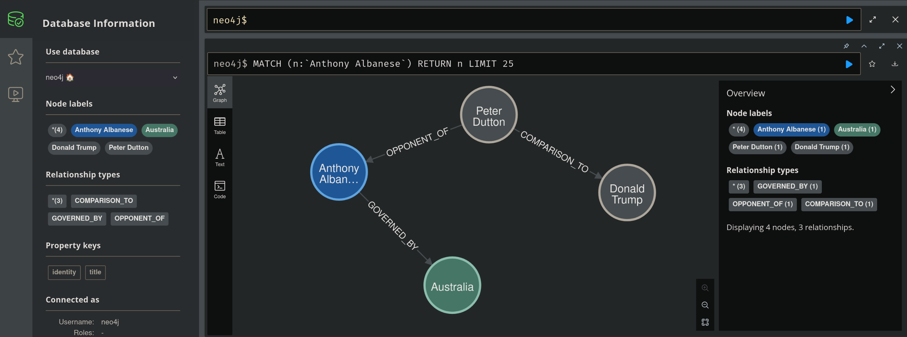
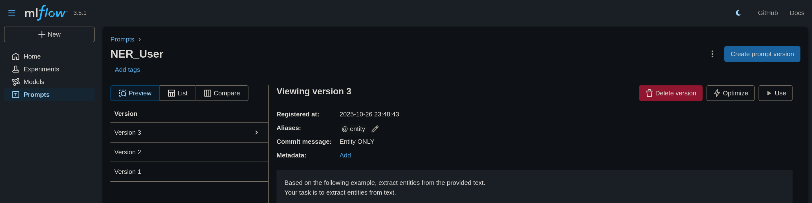
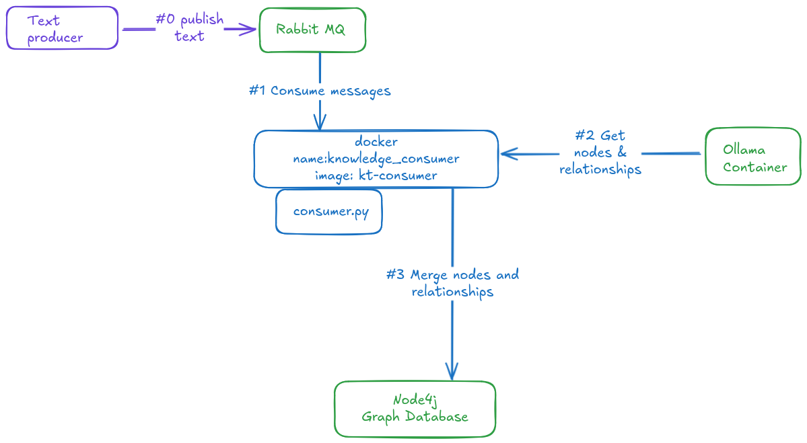
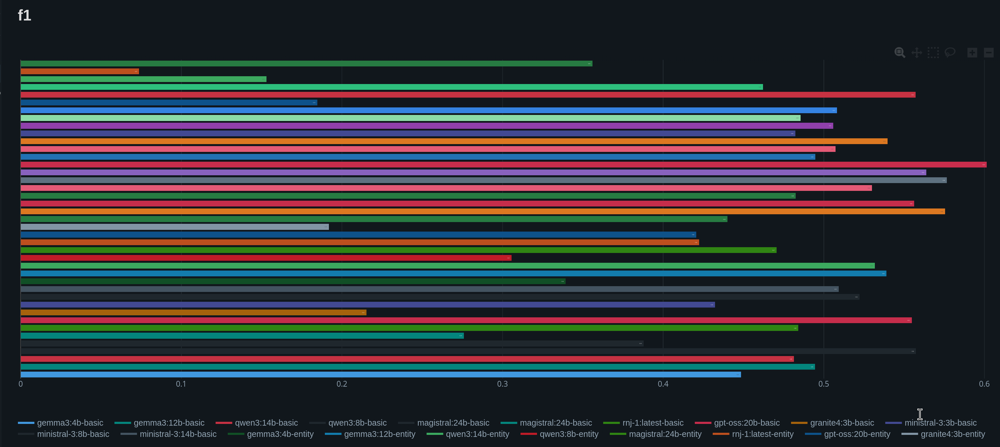
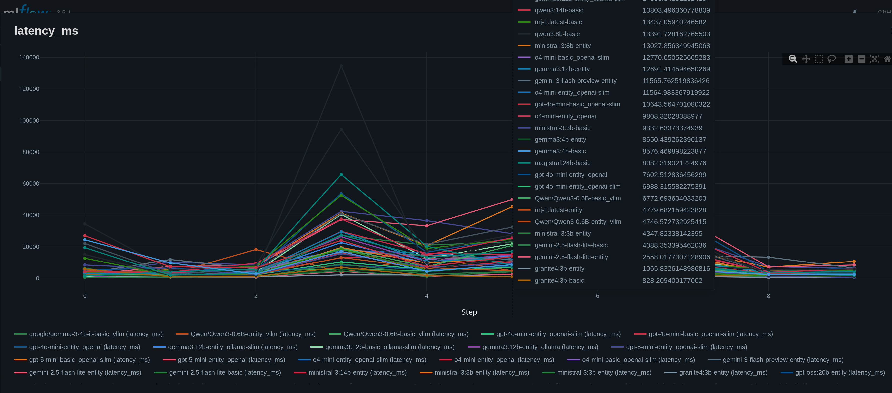
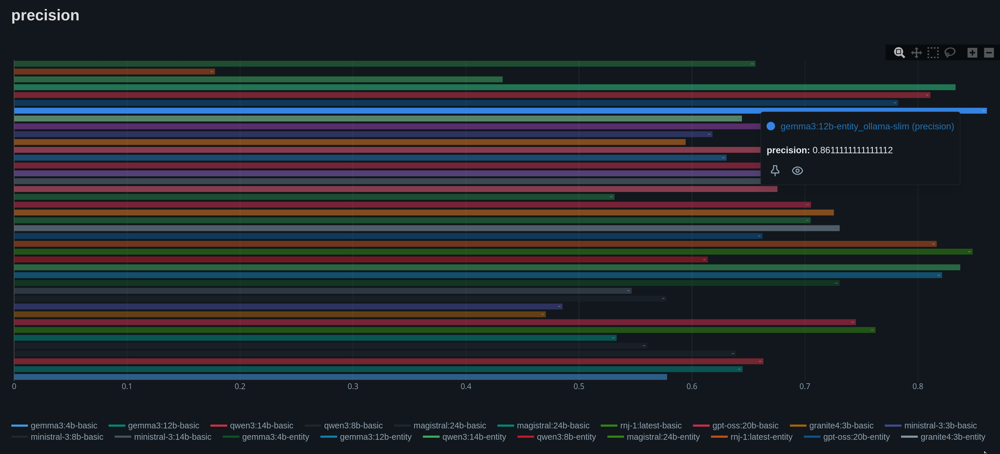
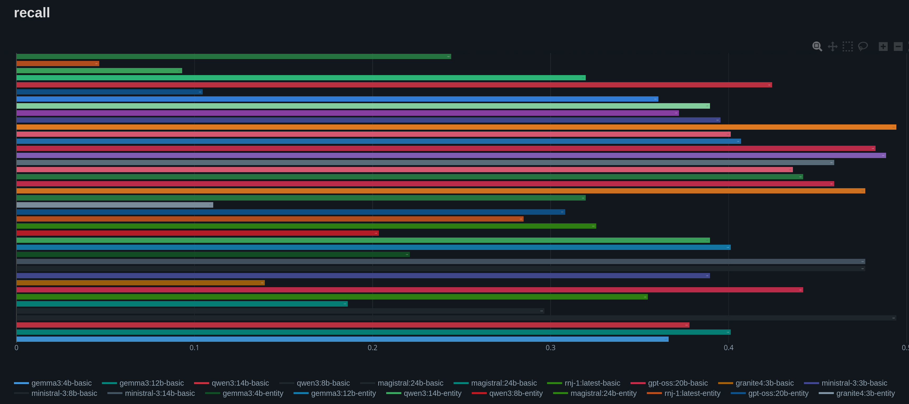

# LLM Knowledge Graph

Use an LLM to generate a knowledge graph.

The purpose of the library is to extract entities and their relationships without a pre-defined schema.

**Input**: Paragraphs of text

**Output**: Nodes and Relationships

**Output**: Merge the nodes into the Knowledge Graph database

## Install and use library

```bash
pip install llm_ner_nel
``` 

```python
from llm_ner_nel.inference_api.relationship_inference import RelationshipInferenceProvider, display_relationships

text = '''Vincent de Groof (6 December 1830 – 9 July 1874) was a Dutch-born Belgian early pioneering aeronaut. He created an early model of an ornithopter'''

inference_provider = RelationshipInferenceProvider(model="llama3.2")
relationships = inference_provider.get_relationships(text)

display_relationships(relationships, console_log=True)
```

Output:
```
Vincent de Groof:(1.0) (Person) --[born in]-> Dutch-born Belgian:(1.0) (Location)
Vincent de Groof:(1.0) (Person) --[created an early model of]-> an ornithopter:(1.0) (Thing)
Vincent de Groof:(1.0) (Person) --[pioneering aeronaut]-> early:(1.0) (Attribute)

``` 

## Dev environment setup - Knowledge Graph

```bash
pip install -e .
``` 

```python

from llm_ner_nel.inference_api.relationship_inference import RelationshipInferenceProvider, display_relationships
from llm_ner_nel.knowledge_graph.graph import KnowledgeGraph

text = '''Australia’s centre-left prime minister, Anthony Albanese, has won a second term with a crushing victory over the opposition, whose rightwing leader, Peter Dutton, failed to brush off comparisons with Donald Trump and ended up losing his own seat.
Australians have voted for a future that holds true to these values, a future built on everything that brings us together as Australians, and everything that sets our nation apart from the world'''

inference_provider = RelationshipInferenceProvider(model="llama3.2") 
relationships = inference_provider.get_relationships(text)

display_relationships(relationships, console_log=True)

graph.add_or_merge_relationships(relationships, "https://en.wikipedia.org/wiki/Vincent_de_Groof", "Wikipedia")
```




## Try it using a Jupyter Notebook:

[knowledge_graph.ipynb](notebooks/knowledge_graph.ipynb)

[ner.ipynb](notebooks/ner.ipynb)

Use the conda environment:


### Environment setup

#### Neo4j

Run a local instance of the Neo4J database

- Run the startNeo4j.sh script
- Or run the following

```bash
docker run \
    --name neo4j \
    -d --rm \
    -p 7474:7474 -p 7687:7687 \
    --name neo4j-apoc \
    --volume=./data:/data \
    -e NEO4J_AUTH=neo4j/password \
    -e NEO4J_apoc_export_file_enabled=true \
    -e NEO4J_apoc_import_file_enabled=true \
    -e NEO4J_apoc_import_file_use__neo4j__config=true \
    -e NEO4J_PLUGINS=\[\"apoc\"\] \
    neo4j:2025.03
```

Verify access to Neo4J:

http://localhost:7474/browser/

- Username: neo4j
- Password: password

#### Python dependencies

Install the following dependencies:

```bash
pip install -r requirements.txt
```

Alternatively, setup a conda environment and install the dependencies:

```bash
conda create -n knowledge-graph python=3.10
conda activate knowledge-graph
pip install -r requirements.txt
# if running Jupyter notebook on VSCODE
pip install -U ipykernel
```

#### Local LLM - Ollama

Run a local LLM using OLLAMA.

- Download and install OLLAMA:
https://ollama.com/download

- Download the LLM Model

```bash
ollama run gemma3:12b
```

Note: if you have a GPU or an environment with High Bandwidth Memory, then it is recommended to run a larger model.

## Example
Model: **gemma3:27b**


```python
from llm_ner_nel.inference_api.relationship_inference import RelationshipInferenceProvider, display_relationships
from llm_ner_nel.knowledge_graph.graph import KnowledgeGraph

from llm_ner_nel.inference_api.relationship_inference import RelationshipInferenceProvider, display_relationships
from llm_ner_nel.knowledge_graph.graph import KnowledgeGraph
graph = KnowledgeGraph()

inference_provider = RelationshipInferenceProvider(model="gemini-2.5-flash-lite",strategy="google") 
inference_provider = RelationshipInferenceProvider(model="llama3.2",strategy="ollama") 
        
graph=KnowledgeGraph()

# Get relationships from text
relationships = relationships_extractor.get_relationships(text=text)

# Merge the relationships to a knowledge graph                    
graph.add_or_merge_relationships(relationships, src="book", src_type="politics")
```

## Hyper parameters

The LLM hyper parameters can be defined, these would help to refine the expected output for concrete use-cases:

```python
class LlmConfig:
        
    model: str
    temperature: float
    top_k: int
    top_p: float
    max_tokens: int
    repeat_penalty: float
    frequency_penalty: float
    presence_penalty: float
    typical_p: float
    num_thread: int
```

## Prompt management

See default prompt in
[prompts.py](src/llm_ner_nel/inference_api/prompts.py)

Prompts can vary between models/providers. Version controlling the prompts and annotating the prompt helps with faster evaluation.

MlFlow provides a prompt repository and is used to get the user prompt and system prompt.

E.g. prompts for named entity recognition

```bash
-e MLFLOW_SYSTEM_PROMPT_ID=NER_System/@entity \
-e MLFLOW_USER_PROMPT_ID=NER_User/@entity \
```

E.g. prompts for a knowledge graph using named entity recognition (NER) and named entity linking (NEL)

```bash
-e MLFLOW_SYSTEM_PROMPT_ID=NER_System/@relationship \
-e MLFLOW_USER_PROMPT_ID=NER_User/@relationship \
```



## Data pipelines - Consumers

Two data pipeline examples show how Named Entity Recognition can be used:

- Decorate text with entities
- Build a knowledge graph

E.g.

### PDF Knowledge Graph Builder

In this example, a folder is passed as an argument, entities and their relationships are extracted from the PDF documents located in the folder. The relationships are merged to the Neo4J knowledge graph.

```bash
docker run -e OLLAMA_MODEL=gemma3:12b \
           -e OLLAMA_HOST=http://ollama:11434 \
           -e MLFLOW_SYSTEM_PROMPT_ID=NER_System/@entity \
           -e MLFLOW_USER_PROMPT_ID=NER_User/@entity \
           -e MLFLOW_TRACKING_HOST=http://mlflow:5000
           -e NEO4J_URI=bolt://neo4j-apoc:7687 \
           -e NEO4J_USERNAME=neo4j \
           -e NEO4J_PASSWORD=password \
           -v /PATH_TO_FOLDERS_WITH_PDFS:/mnt
           --network development_network \
           --rm \
           --name pdf_graph_builder \
           --hostname pdf_graph_builder \
           pdf_graph_builder
```

### Mongo DB entitiy extractor

In this example text is read from a MongoDb Collection and the entities are extracted/stored back to the mongodb collection.

The container would read a collection in batches and perform NER.

```bash
docker run -e OLLAMA_MODEL=gemma3:12b \
           -e OLLAMA_HOST=http://ollama:11434 \
           -e MONGODB_CONNECTION_STRING=mongodb://mongodb:27017 \
           -e MLFLOW_SYSTEM_PROMPT_ID=NER_System/@entity \
           -e MLFLOW_USER_PROMPT_ID=NER_User/@entity \
           -e MLFLOW_TRACKING_HOST=http://mlflow:5000
           --network development_network \
           --rm \
           --name entity_extractor \
           --hostname entity_extractor \
           mongodb-entity-extractor
```


### RabbitMQ Knowledge Graph Builder

Use RabbitMQ to Publish/Consume messages.

The messages will be processed and merged to a knowledge graph




Message format:
```json
{
  "src": "https://en.wikipedia.org/wiki/Vincent_de_Groof",
  "src_type": "Newspaper",
  "text": "Vincent de Groof (6 December 1830 – 9 July 1874) was a Dutch-born Belgian early pioneering aeronaut. He created an early model of an ornithopter and successfully demonstrated its use before fatally crashing the machine in London, UK.[1] "
}

```

### Pipeline dependecy RabbitMq

Start rabbitmq:
```bash
docker run -d --rm --network development_network --hostname rabbitmq --name rabbitmq -p 15672:15672 -p 5672:5672 rabbitmq:3.8.12-rc.1-management
```

In this example data is published to a rabbitmq queue. The data is consumed and appended to a Neo4j Knowledge Graph

```bash
docker run -e RABBITMQ_PORT=5672 \
           -e RABBITMQ_HOST=rabbitmq \
           -e RABBITMQ_VHOST=dev \
           -e RABBITMQ_QUEUE=DatapipelineCleanData \
           -e RABBITMQ_USER=guest \
           -e RABBITMQ_PASSWORD=guest \
           -e OLLAMA_MODEL=gemma3:12b \
           -e OLLAMA_HOST=http://ollama:11434 \
           -e NEO4J_URI=bolt://neo4j-apoc:7687 \
           -e NEO4J_USERNAME=neo4j \
           -e NEO4J_PASSWORD=password \
           -e MLFLOW_SYSTEM_PROMPT_ID=NER_System/@relationship \
           -e MLFLOW_USER_PROMPT_ID=NER_User/@relationship \
           -e MLFLOW_TRACKING_HOST=http://mlflow:5000 \
           --network development_network \
           --rm \
           --name knowledge_consumer \
           --hostname knowledge_consumer \
           rabbit-mq-graph-builder
``` 

### Dependencies

Ollama should be running in a docker container; or a network route should be available.

Run the following for a CPU-Only ollama instance:

```bash
docker run -d --rm 
    -v /usr/share/ollama/.ollama:/root/.ollama \
    -p 11434:11434 \
    --network development_network \
    --name ollama \
    --hostname ollama  \
    ollama/ollama

```

Note: replace the path **/usr/share/ollama/.ollama** to the host's ollama model path


## Evaluation

Due to the sheer amount of model options and inference providers; it is necessary to evaluate.

Evaluation allows methodical selection of hyper parameters:
- User Prompt (based on model and provider)
- System Prompt (based on model and provider)
- Model

### Evaluation criteria
The first step of an evaluation criteria is to define ground truths:

Text --> Expected entities

E.g.

```csv
"Input", "GroundTruth"
"Amazon and Google announced a partnership.","Amazon|Google"
``` 

Based on the ground truth calculate the following:
- True positives (TP)
- False positives (FP)
- False negatives (FN)

Using the above calculate the following:
- Precision
- Recall

Finally calculate an F1 score.

### Precision

Proportion of correctly identified entities (accuracy).

High precision means that when the model identifies an entity, it is likely to be correct.


$$
\begin{aligned}
\text{Precision} &= \frac{TP}{TP + FP}
\end{aligned}
$$

Where:
- \( TP \) = True Positives
- \( FP \) = False Positives

### Recall 

Ability to find the relevant entities.

High recall means the model has detected most of the actual entities in the text.

$$
\begin{aligned}
\text{Recall} &= \frac{TP}{TP + FN}
\end{aligned}
$$

Where:
- \( TP \) = True Positives
- \( FN \) = False Negatives

### F1 Score
$$
\begin{aligned}
F1 &= 2 \times \frac{\text{Precision} \times \text{Recall}}{\text{Precision} + \text{Recall}}
\end{aligned}
$$


## Experiments

Publish the evaluation metrics for each "experiment". 

ML-Flow is a good tool for analysis.

Below is an example of using ML-Flow to experiment hypotheses and evaluate.

**Hypothesis: using a system prompt does not yield any significant improvements.**


[See Experiment](documentation/experiment_system_prompt.md)

## Metrics

Below are some evaluations which helps defines metrics to pick the appropriate strategy:
- LLM Model
- Local vs. Cloud
- Estimate costs
- Precision and Recall
- Latency

### F1-Score

Run several models, with various prompting strategies.
Evaluate and pick the best F1 Score.


### Latency
Run several models, locally and on the cloud.
Evaluate and pick the best performing latency.



### Precision and Recall

Evaluate the precision and recall:






### Conclude evaluation

Pick the metric most significant, then short-list the models, and do a cost analysis.

To evaluate several weights can be given to each of the metric.

E.g. load your metrics and use a ranker to evaluate:

**(e.g. Latency: 3, Precision:2 and F1: 1)**


[See example evaluation -- evaluation.ipynb](evaluation/evaluation.ipynb)


## Conclusion (local vs. cloud)

### NER Workflow Metrics Summary

### Key Metrics:

* **Latency:** Processing millions of documents can take a significant amount of time.
* **F1 Score:** Measures precision and recall balance.
* **Cost:** Affected by whether processing is done locally or in the cloud.

### Inference Cost (24/7, Nvidia 4060 TI):

* **Estimated electricity cost:** ~$20

---

### **Local Workflows**

| Model                 | F1 Score | Latency (ms) | Conclusion                                             |
| --------------------- | -------- | ------------ | ------------------------------------------------------ |
| **gemma3:12b-entity** | 0.539062 | 10,048.05    | Too slow. Consider trying a quantized version on VLLM. |
| **qwen3:14b-entity**  | 0.531746 | 7,883.89     | Good candidate to run locally.                         |

**Note:** Running **qwen3:14b-entity** on local hardware for 500,000 documents would take approximately **45 days**, with an estimated cost of **$35**.

---

### **Cloud Workflows**

| Model                            | F1 Score | Latency (ms) | Cost (for 500,000 docs)               | Conclusion                          |
| -------------------------------- | -------- | ------------ | ------------------------------------- | ----------------------------------- |
| **gemini-2.5-flash-lite-entity** | 0.530035 | 1,741.75     | **Google API:** **$150** (21 days)    | Good candidate to run on the cloud. |
| **Vertex AI**                    | 0.530035 | 1,741.75     | **$75** (1-3 days, with 50% discount) | Fast and cost-effective for cloud.  |

---

### Final Takeaways:

* **Local:** If running locally, **qwen3:14b-entity** is a good option with a reasonable cost (~$35 for 500,000 docs), but may take a long time (45 days).

* **Cloud:** For faster processing, **Vertex AI** offers the best balance between cost and speed, potentially processing in 1-3 days for $75 (with a discount).

#### 500,000 Documents summary

| **Model**                                | **F1 Score** | **Estimated Duration**   | **Cost**                |
| ---------------------------------------- | ------------ | ------------------------ | ----------------------- |
| **gemma3:12b-entity (local)**            | 0.539062     | (not estimated) | ~$45  |
| **qwen3:14b-entity (local)**             | 0.531746     | ~45 days                  | ~$35  |
| **gemini-2.5-flash-lite-entity (cloud)** | 0.530035     | ~21 days (Google API)     | ~$150       |
| **Vertex AI (cloud)**                    | 0.530035     | ~1-3 days                 | ~$75 (with vertex discount)    |


## License

Copyright (C) 2025  Paul Eger

This program is free software: you can redistribute it and/or modify
it under the terms of the GNU General Public License as published by
the Free Software Foundation, either version 3 of the License, or
(at your option) any later version.
This program is distributed in the hope that it will be useful,
but WITHOUT ANY WARRANTY; without even the implied warranty of
MERCHANTABILITY or FITNESS FOR A PARTICULAR PURPOSE.  See the
GNU General Public License for more details.

You should have received a copy of the GNU General Public License
along with this program.  If not, see <https://www.gnu.org/licenses/>.